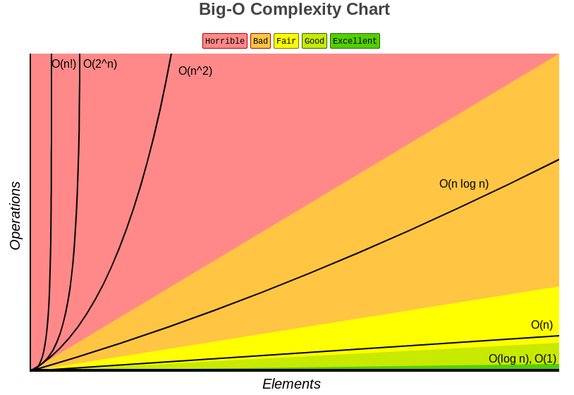
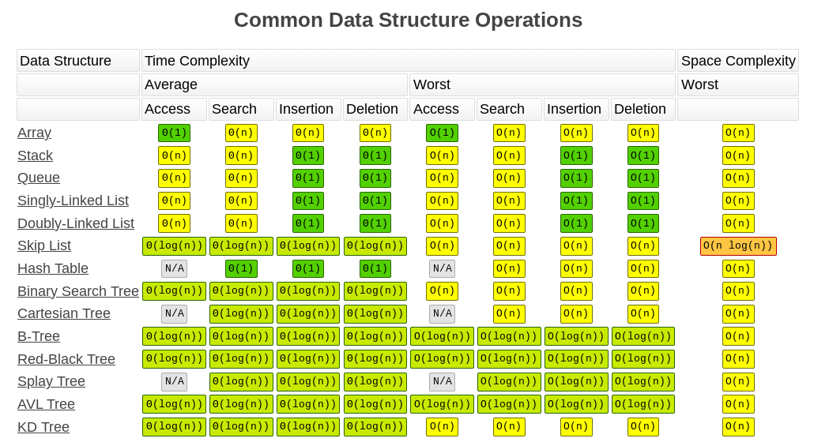
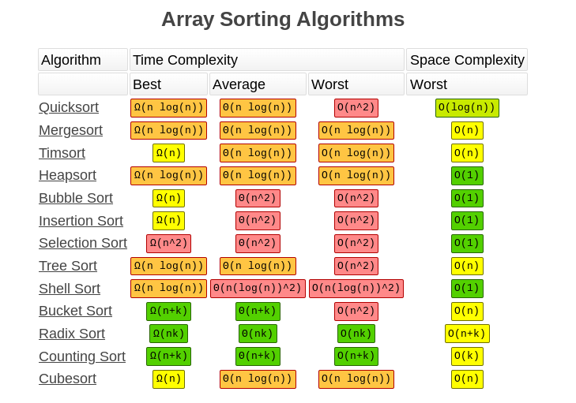

# Algorithmic Problem Solving

# S.E.A.T.
- Summarize
- Examples
- Approach
- Test

## Problem Solving
Objectives:
* Demonstrate how a structured approach to problem solving improves technical interview outcomes
* Implement a structured approach to algorithmic problem solving

### Questions:
* What are the essential steps in algorithmic problem solving?
* What do you do if you are unsure how to solve a problem?
* How do you ensure that your approach is valid?
* What tests should you create when preparing to solve a problem?

## Big O
Objectives:
* Analyze solutions to algorithmic problems using Big O Notation 
* Optimize a algorithm for time complexity

### Questions
* What are some examples of Big O notation?  What do they tell you?
* Why is time complexity analysis an important skill in technical interviews?
* What are the limits of Big O notation?  What does Big O not tell you about an algorithm?
* What does it mean to optimize an algorithm?  How do you get started in doing so?

# What is an algorithm?
- Instructions on how to solve a problem
- A process to be followed in calculations or other problem-solving operations

## Types of algorithms
- Merge sort
- Recursive 
    - Dynamic programming
    - Divide-and-conquer
    - Greey algorithm
    - Backtracking
- Randomized algorithm
- Quick sort
- Sorting algorithm
- Binary search
- Machine learning
- Bubble sort
- Hash function
- Selection sort
- Insertion sort
- Counting sort
- Bucket sort
- Heap sort
- Hierarchical clustering
- Search algorithm
- Radix sort
- Bellman-Ford algorithm
- Linear search
- Knuth-Morris-Pratt
- Geometry
- Recursive
- etc....

# What is big O notation?
Big O Analysis
- A comparative way to classify different algorithms
- Based on shape of growth curve (time vs input size(s))
- For big enough inputs (length of something i.e. array)
- Analyzes worst case (really big) inputs
- Including just the highest order term (i.e. ln f(n) = n^3 + 5n + 3, only n^3 matters as n gets large)

## Common Types of Time COmplexities
- X is size of input (n)
- Y is time for the function to complete

- O(1) - Constant time complexity
- O(n) - Linear time complexity
- O(log n) - Logarithmic time complexity
- O(n^2) - Quadratic time complexity

|Big O        | Name        | Think       | Example     |
| ----------- | ----------- | ----------- | ----------- |
| O(1)        | Constant    | Doesn't depend on input | get array value by index |
| O(log n)    | Logarithmic | Using a tree | Find min element of BST |
| O(n)        | Linear      | Checking all elements | Search through a list |
| O(n - log n)| Loglinear   | tree levels * elements | Merge sort average & worst case |
| O(n^2)      | Quadratic   | Checking pairs of elements | Bubble sort average & worst case |
| O(2^n)      | Exponential | Generating all subsets | burte-force n-long binary number |
| O(n!)       | Factorial   | Generating all permutations | Traveling Salesman |

<br/>




### O(1) - Constant time complexity
- Constant time algorithms will always take the same amount of time to be executed. The execution time of these algorithm is independent of the size of the input
- Example: 
    - Accessing a value with an array index: `var arr = [1,2,3,4,5]`
    - push()
    - pop()

### O(n) - Linear time complexity
- An algorithm has a linear time complexity if the time to execute the algorithm is directly proportional to the input size `n`. Therefore the time it will take to run the algorithm will increase proportionately as the size of input `n` increases.
- Example:
    - Finding a CD in a stacks of CDs
    - Reading a book where `n` is the number of pages
    - Linear Search: `for (var i = 0; i &lt; array.length; i++) {  console.log(array[i]);}`

### O(log n) - Logarithmic time complexity
- An algorithm has logarithmic time complexity if the time it takes to run the algorithm is proportional to the logarithm of the input size `n`. 
- Example:
    - For loop: `for(var i = 1; i < n; i = i * 2)`
    - Binary search implementation
    ```
    var doSearch = function(array, targetValue) {    
        var minIndex = 0;    
        var maxIndex = array.length - 1;    
        var currentIndex;    
        var currentElement;        
        
        while (minIndex <= maxIndex) {       
            currentIndex = (minIndex + maxIndex) / 2 | 0;        
            currentElement = array[currentIndex];        
            
                if (currentElement < targetValue) {            
                    minIndex = currentIndex + 1;        
                } else if (currentElement > targetValue) {            
                    maxIndex = currentIndex - 1;        
                } else {
                    return currentIndex;        
                }    
            }    
        return -1;  
        //If the index of the element is not found
    };
    ```
### O(n^2) - Quadratic time complexity
- An algorithm has quadratic time complexity if the time to execution it is proporational to the square of the input size. 
- Example:
    - Duplicate in a deck of cards
    - Bubble Sort
    - Selection sort
    - Insertion sort
    - Nested iterations (nested for loops)
    ```
    for(var i = 0; i < length; i++) {
    //has O(n) time complexity    
    
        for(var j = 0; j < length; j++) { 
        //has O(n^2) time complexity      
        // More loops?    
        }
    }
    ```

## Common Data Structure Operations
- 
- 
- 


## Array Sorting Algorithms
- 
- 
- 



# Resources
- [Most important type of Algorithms by Geeks for Geeks](https://www.geeksforgeeks.org/most-important-type-of-algorithms/)
- [Problem Solving Approaches](https://drive.google.com/file/d/1FADqam7PWt2tqp1DW0j0uODTJ50Jr7AO/view)
- [Big O Complexity Chart](https://www.bigocheatsheet.com/)
- [Beginners Guide to Big O Notation](https://www.freecodecamp.org/news/my-first-foray-into-technology-c5b6e83fe8f1/)
- [What is Big O Notation Explained: Space and Time Complexity](https://www.freecodecamp.org/news/big-o-notation-why-it-matters-and-why-it-doesnt-1674cfa8a23c/)